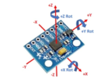
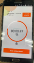

# 아두이노 프로젝트

기존에 있던 아두이노를 사용하는 cpr일 경우 as is to be로 기존에 어느정도까지 사용이 되었고, 이거를 개선하는 이유는 무엇이며 어떻게 개선할지를 기술하기

## CPR 문제점
1. 긴박한 심폐소생술 중에 심정지 리듬을 확인하기 위해 흉부 압박을 빈번하게 중단하면 심장 및 뇌의 허혈성 손상을 더욱더 증가시킨다.->흉부 압박 중 제세동이 필요한 리듬을 인지하는 비접촉식 알고리즘 개발중 https://post.naver.com/viewer/postView.nhn?volumeNo=28800746&memberNo=49312582
2. 일반인의 경우 인공호흡을 정확히 실시하지 못하기때문에 가슴압박만 한것과 인공호흡까지 한것, 두 개의 소생률에 큰 차이가 없다.(2015 심폐소생술 가이드라인)
3. 시카고 병원 내에서 시행된 67건의 cpr을 분석한 결과 흉부압박이 분당 90회 이하이거나(26%) 압박깊이가 너무 얕거나(37%) 인공호흡 횟수가 분당 20회(61%)로 지나치게 많은것으로 나타났다. https://www.khanews.com/news/articleView.html?idxno=464

## 아이디어
1. 압박부위에 압력센서를 부착 후 압력을 측정하여 분당 100~120회를 할 수 있도록 도와주고, 압력은 충분한지를 측정하여 CPR 교육을 잘 진행하도록 도와준다.
2. 심폐소생술을 실시할 경우 가슴압박에 집중하여 기도확보를 등안시 하는 경우가 있다. 이를 자이로 센서를 통해 교육 도중 기도 확보 여부를 알려준다.
3. 인공호흡의 경우에 일반인은 인공호흡을 하지 않는 경우와 하는 경우의 소생성공률의 차이가 없다. 그러므로 인공호흡은 하지 않는 걸로 가정한다.

## UI 기본 틀
http://www.safetimes.co.kr/news/articleView.html?idxno=94064

## Arduino Project contents
### 1. Project 방향
 1. CPR기계에 아두이노를 연결하여 CPR교육을 더욱 원활하게 하여 소생성공률을 높힌다.
 2. 교육에 흥미를 가지도록 시간별로 압박 강도와 기도 확보를 자이로 센서와 압박센서를 어플리케이션을 통해 실시간으로 알려준다.
 3. 또한 설정한 시간동안 CPR 교육을 진행한 후 점수를 통해 진행한 CPR training의 정확도를 나타낸다.
### 2. 동기
  1. 심페소생술 시행 시 정확하게 진행이 되지 않을 시 환자에게 더욱 안 좋을 수 있다.
  2. 기도확보가 잘 되지 않거나 압박강도가 정확하지 않은 경우가 많이 있다.
  3. cpr교육에 흥미를 느끼고 전체 점수를 통해서 자신이 얼마나 잘했는지를 평가하여 CPR training의 정확도를 높힌다. 이로 인해 소생 성공률을 높힐 수 있다.
### 3. 흐름도
   

### 4. 자이로 센서
   
### 5. 압력 센서
   
   압력센서는 FSR402압력센서로 물리적인 힘, 무게에 따라 저항 값이 바뀌는 성질을 이용한 센서로 압력 센서라고도 한다. 본 논문에서는 CPR교육 중 압박 강도를 측정하기 위해서 사용되었다.
### 6. 블루투스 모듈
   
### 7. 압력센서와 자이로센서와 블루투스를 연동하여 핸드폰으로 출력
   
